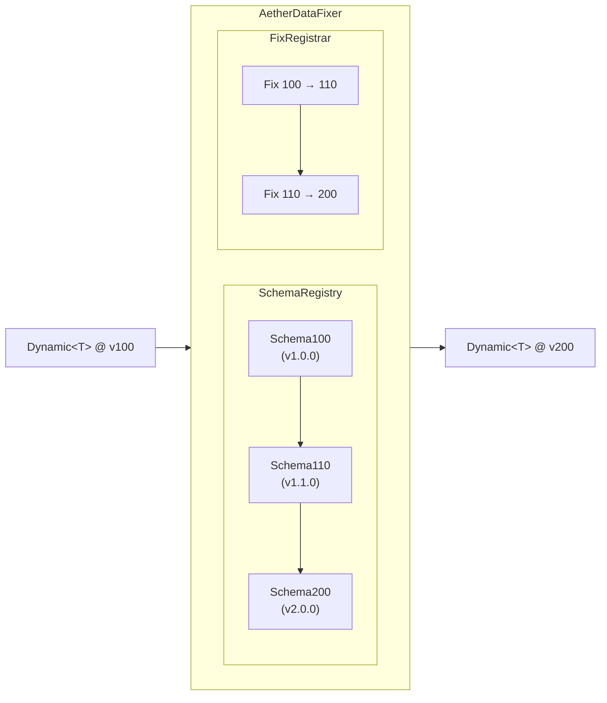
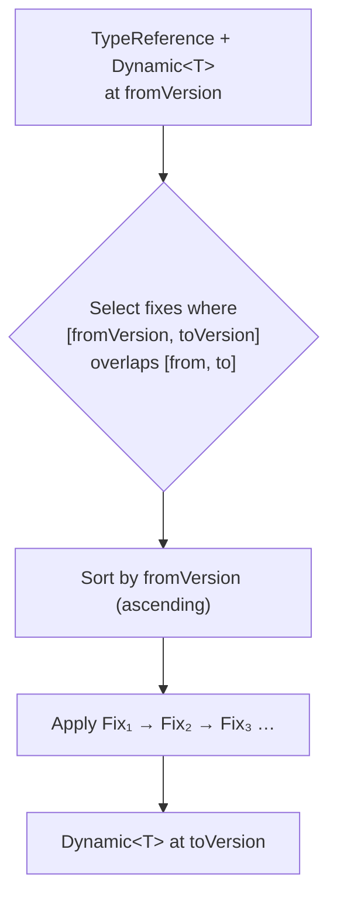
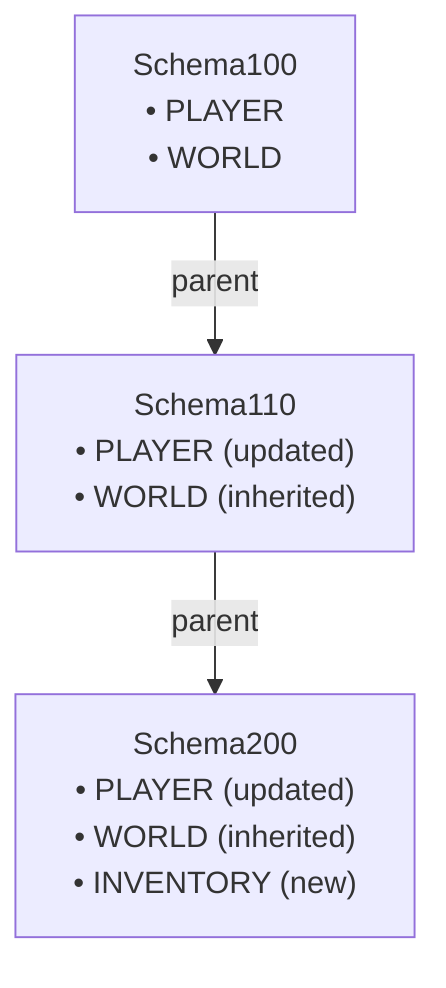
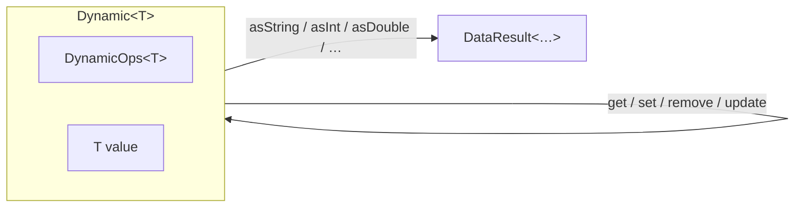
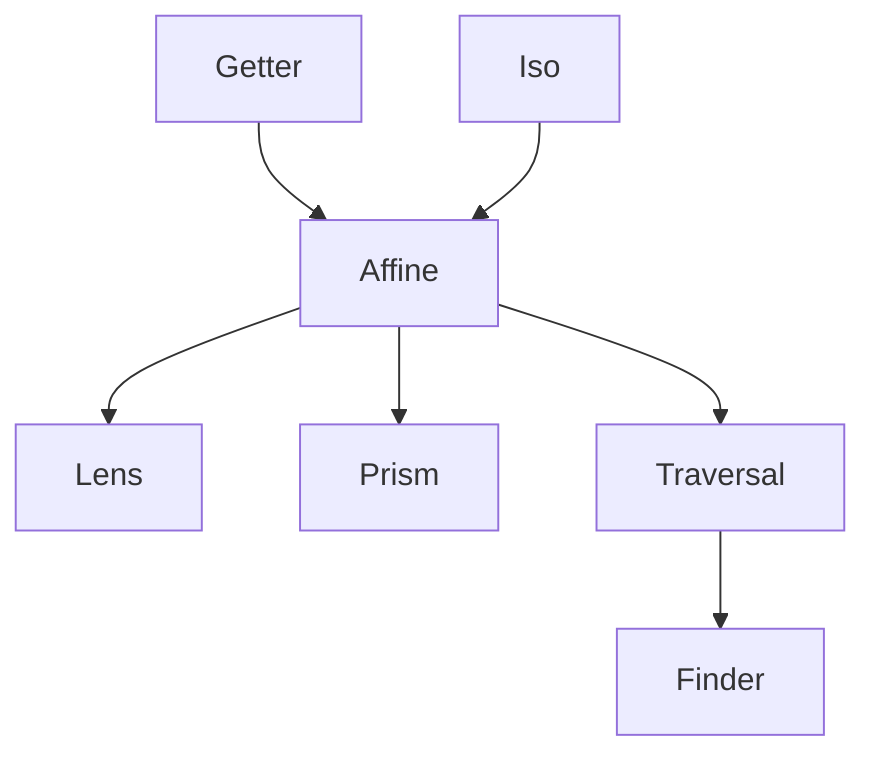

# Architecture Overview

<show-structure for="chapter,procedure" depth="2"/>

<tldr>
    <p>%product% is a <b>forward-patching</b> data migration framework.
       A <code>DataFixer</code> holds a chain of versioned <code>Schema</code>&apos;s and
       <code>DataFix</code>&apos;es and migrates any <code>Dynamic&lt;T&gt;</code> value
       from an older <code>DataVersion</code> to a newer one.</p>
</tldr>

## The Big Picture



A fixer is assembled once from a `DataFixerBootstrap` and used many times. It is
**thread-safe**, so you can share one instance across the whole application.

## Module Layout

<deflist type="medium">
    <def title="%artifact_api%">
        Interfaces and abstract contracts. <i>Defines what the framework can do, not how.</i>
        &mdash; <code>DataVersion</code>, <code>TypeReference</code>, <code>Schema</code>,
        <code>DataFix</code>, <code>DataFixer</code>, <code>Dynamic</code>,
        <code>DynamicOps</code>, <code>Codec</code>, <code>DSL</code>, optics, rules.
    </def>
    <def title="%artifact_core%">
        Default implementations: <code>AetherDataFixer</code>,
        <code>DataFixerRuntimeFactory</code>, <code>SchemaDataFix</code>,
        <code>SimpleTypeRegistry</code>, and the core bootstrap flow.
    </def>
    <def title="%artifact_codec%">
        <code>DynamicOps</code> implementations for every format shipped out of the box:
        Gson, Jackson (JSON/YAML/TOML/XML), and SnakeYAML.
    </def>
    <def title="%artifact_testkit%">
        <code>TestData</code> fluent builders, AssertJ extensions
        (<code>AetherAssertions</code>), and harnesses
        (<code>DataFixTester</code>, <code>MigrationTester</code>, <code>SchemaTester</code>).
    </def>
    <def title="%artifact_bom%">
        Bill of Materials &mdash; import it once to keep all module versions aligned.
    </def>
</deflist>

## Migration Data Flow

When `fixer.update(type, dynamic, from, to)` is called, data flows through the
system in four steps:



<note>
    <p>
        If <code>from</code> is already greater than or equal to <code>to</code>, no fixes
        are applied and the input is returned unchanged.
    </p>
</note>

## Bootstrap Flow

<procedure title="How a DataFixer is assembled" id="bootstrap-flow-procedure">
    <step>
        <p>Your <code>DataFixerBootstrap</code> is handed to
           <code>DataFixerRuntimeFactory.create(currentVersion, bootstrap)</code>.</p>
    </step>
    <step>
        <p>The factory calls <code>registerSchemas(SchemaRegistry)</code>; you create the
           schema chain (parent → child → child …) and register every version.</p>
    </step>
    <step>
        <p>The factory calls <code>registerFixes(FixRegistrar)</code>; you bind each
           <code>DataFix</code> to the <code>TypeReference</code> it acts on.</p>
    </step>
    <step>
        <p>The factory wires everything into an <code>AetherDataFixer</code> and returns
           it. From this point on, the fixer is immutable and ready for concurrent use.</p>
    </step>
</procedure>

## Component Relationships

### Schema owns TypeRegistry

A `Schema` pairs a `DataVersion` with a `TypeRegistry` &mdash; a map from
`TypeReference` to `Type`. The registry is built lazily on first access, so
subclasses can register types from their constructor.

### Schema inheritance

Child schemas inherit every type from their parent and only register types that
changed. This keeps each schema focused on deltas.



### DataFix and rules

A `DataFix` declares `fromVersion`, `toVersion`, and a `name`. In practice you
extend [`SchemaDataFix`](datafix-system.md) and express the
transformation as a `TypeRewriteRule` composed via the
[`Rules`](rewrite-rules.md) combinators.

## Dynamic and DynamicOps

`Dynamic<T>` is the data wrapper that decouples migrations from the underlying
format. It carries the value **and** the `DynamicOps<T>` that knows how to read
and write it.



The same fix code runs against JSON, YAML, TOML, XML, or anything you implement
`DynamicOps` for.

## Codec Composition

Codecs provide bidirectional transformation between typed Java values and
`Dynamic<T>`. They are composable &mdash; assemble complex codecs from primitive
ones with `RecordCodecBuilder`:

```java
Codec<Player> PLAYER = RecordCodecBuilder.create(instance -> instance.group(
        Codecs.STRING.fieldOf("name").forGetter(Player::name),
        Codecs.INT.fieldOf("level").forGetter(Player::level),
        Position.CODEC.fieldOf("position").forGetter(Player::position)
).apply(instance, Player::new));
```

## Optics

Optics are composable accessors for nested data. They sit on a small hierarchy:



`Finder` is the most common entry point &mdash; it navigates a `Dynamic` value
along a path you describe in terms of other optics.

## Thread-Safety At A Glance

| Component         | Guarantee                                                |
|-------------------|----------------------------------------------------------|
| `DataVersion`     | Immutable &mdash; safe.                                  |
| `TypeReference`   | Immutable &mdash; safe.                                  |
| `Schema`          | Effectively immutable after lazy init &mdash; safe.      |
| `AetherDataFixer` | Thread-safe; share across threads.                       |
| `Dynamic<T>`      | Immutable; operations return new instances.              |
| `DataResult<T>`   | Immutable &mdash; safe.                                  |
| `DataFixerContext`| Per-migration; **do not** share between concurrent calls.|

## Design Principles

<deflist type="full">
    <def title="Immutability">
        Core types never mutate. <code>Dynamic</code> operations return new instances;
        <code>Schema</code>&apos;s are effectively immutable after initialisation.
    </def>
    <def title="Format agnosticism">
        The framework assumes nothing about your serialisation format &mdash; every
        operation goes through <code>DynamicOps</code>.
    </def>
    <def title="Forward patching only">
        Data always migrates old &rarr; new. No rollbacks. The simpler invariant makes
        migrations easier to reason about.
    </def>
    <def title="Schema-driven">
        The structure of data at every version is explicit. Fixes operate against
        well-defined shapes, not guesses.
    </def>
    <def title="Composition">
        Rules, codecs, and optics all compose. Complex migrations are built from small,
        reusable building blocks.
    </def>
</deflist>

<seealso style="cards">
    <category ref="wrs">
        <a href="data-version.md" summary="Integer identifiers for schema versions."/>
        <a href="type-reference.md" summary="String keys that route data to the correct fixes."/>
        <a href="schema-system.md" summary="Versioned type registries and schema inheritance."/>
        <a href="datafix-system.md" summary="Creating and applying migrations."/>
    </category>
</seealso>
