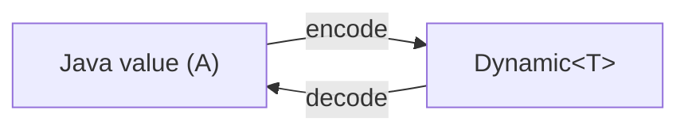

# Codec System

<show-structure for="chapter,procedure" depth="2"/>

<tldr>
    <p>A <code>Codec&lt;A&gt;</code> is a bidirectional bridge between a typed Java
       value and a <code>Dynamic&lt;T&gt;</code>. It combines an
       <code>Encoder&lt;A&gt;</code> (Java &rarr; Dynamic) and a
       <code>Decoder&lt;A&gt;</code> (Dynamic &rarr; Java) and composes cleanly into
       larger structures.</p>
</tldr>

## The Contract



```java
public interface Codec<A> extends Encoder<A>, Decoder<A> {}

public interface Encoder<A> {
    <T> DataResult<T> encode(A input, DynamicOps<T> ops, T prefix);
}

public interface Decoder<A> {
    <T> DataResult<Pair<A, T>> decode(DynamicOps<T> ops, T input);
}
```

Both directions surface errors through [`DataResult`](data-result.md),
so decoding never throws on malformed input &mdash; it returns a typed failure
you can recover from.

## Built-in Codecs

`Codecs` ships primitive codecs that cover every JVM scalar, plus a few
specials:

| Constant             | Java type      |
|----------------------|----------------|
| `Codecs.BOOL`        | `Boolean`      |
| `Codecs.BYTE`        | `Byte`         |
| `Codecs.SHORT`       | `Short`        |
| `Codecs.INT`         | `Integer`      |
| `Codecs.LONG`        | `Long`         |
| `Codecs.FLOAT`       | `Float`        |
| `Codecs.DOUBLE`      | `Double`       |
| `Codecs.STRING`      | `String`       |
| `Codecs.EMPTY`       | unit/void-like |
| `Codecs.PASSTHROUGH` | `Dynamic<?>` (raw) |

## Encoding and Decoding a Primitive

```java
// Encode
DataResult<JsonElement> encoded = Codecs.STRING.encode(
        "Steve",
        GsonOps.INSTANCE,
        GsonOps.INSTANCE.empty()
);
JsonElement json = encoded.result().orElseThrow();   // "Steve"

// Decode
DataResult<Pair<String, JsonElement>> decoded =
        Codecs.STRING.decode(GsonOps.INSTANCE, json);
String name = decoded.result().orElseThrow().first();
```

## Building Record Codecs

`RecordCodecBuilder` is the idiomatic way to compose codecs for data classes
and Java records. Each field is a `MapCodec<A>` &mdash; a codec that reads and
writes against map keys rather than raw values.

```java
public record Player(String name, int level, Position position) {

    public static final Codec<Player> CODEC = RecordCodecBuilder.create(instance ->
            instance.group(
                    Codecs.STRING.fieldOf("name").forGetter(Player::name),
                    Codecs.INT.fieldOf("level").forGetter(Player::level),
                    Position.CODEC.fieldOf("position").forGetter(Player::position)
            ).apply(instance, Player::new)
    );
}

public record Position(double x, double y, double z) {

    public static final Codec<Position> CODEC = RecordCodecBuilder.create(instance ->
            instance.group(
                    Codecs.DOUBLE.fieldOf("x").forGetter(Position::x),
                    Codecs.DOUBLE.fieldOf("y").forGetter(Position::y),
                    Codecs.DOUBLE.fieldOf("z").forGetter(Position::z)
            ).apply(instance, Position::new)
    );
}
```

## Optional and Default Fields

```java
Codecs.STRING.optionalFieldOf("nickname")                  // Optional<String>
Codecs.STRING.optionalFieldOf("nickname", "Anonymous")     // String with fallback
```

## Transforming Codecs

<deflist type="full">
    <def title="xmap(to, from)">
        Isomorphism: safe bidirectional mapping where both directions always succeed.
        Classic example: <code>Codecs.STRING.xmap(UUID::fromString, UUID::toString)</code>.
    </def>
    <def title="flatXmap(to, from)">
        Same, but either direction may fail &mdash; returns a <code>DataResult</code>.
        Use when the mapping can fail (e.g. validating a string as an email).
    </def>
    <def title="list()">
        Lifts a codec to a list: <code>Codecs.INT.list()</code> decodes a JSON array.
    </def>
    <def title="fieldOf(name) / optionalFieldOf(name)">
        Wraps into a <code>MapCodec</code> keyed by a field name.
    </def>
    <def title="orElse(value) / orElseGet(supplier)">
        Provides a fallback value when decoding fails.
    </def>
</deflist>

## Format Independence

A single codec works against every `DynamicOps` implementation. Swap `GsonOps`
for `JacksonYamlOps` or `JacksonTomlOps` and the same codec writes YAML or
TOML:

<tabs group="format">
<tab title="Gson" group-key="gson">

```java
Codec<Player> codec = Player.CODEC;
DataResult<JsonElement> json = codec.encode(player, GsonOps.INSTANCE, GsonOps.INSTANCE.empty());
```

</tab>
<tab title="Jackson JSON" group-key="jackson-json">

```java
DataResult<JsonNode> json = codec.encode(player, JacksonJsonOps.INSTANCE, JacksonJsonOps.INSTANCE.empty());
```

</tab>
<tab title="Jackson YAML" group-key="jackson-yaml">

```java
DataResult<JsonNode> yaml = codec.encode(player, JacksonYamlOps.INSTANCE, JacksonYamlOps.INSTANCE.empty());
```

</tab>
<tab title="SnakeYAML" group-key="snakeyaml">

```java
DataResult<Object> yaml = codec.encode(player, SnakeYamlOps.INSTANCE, SnakeYamlOps.INSTANCE.empty());
```

</tab>
</tabs>

## MapCodec vs Codec

A `Codec<A>` produces a standalone value. A `MapCodec<A>` produces zero or more
key/value entries inside an existing record. Most primitives are
`Codec<A>`; calling `fieldOf("x")` on them yields a `MapCodec<A>` suitable for
`RecordCodecBuilder.group(...)`.

```java
MapCodec<String> nameField = Codecs.STRING.fieldOf("name");
```

## Typical Errors and How to Handle Them

```java
DataResult<Player> decoded = Player.CODEC.decode(GsonOps.INSTANCE, raw)
        .map(Pair::first);

decoded.resultOrPartial().ifPresent(this::onPlayer);
decoded.error().ifPresent(err -> log.warn("decode failed: {}", err.message()));
```

The `DataResult` API gives you `result()`, `error()`, `resultOrPartial()`, and
combinator methods like `map`, `flatMap`, `mapError`.

## Best Practices

<deflist type="full">
    <def title="Define one canonical codec per type">
        Exposed as a <code>public static final Codec&lt;T&gt; CODEC</code> on the
        type itself. Match how the framework ships primitives in <code>Codecs</code>.
    </def>
    <def title="Prefer records for codec-friendly data">
        The <code>apply(instance, Player::new)</code> pattern lines up with record
        canonical constructors, keeping boilerplate to a minimum.
    </def>
    <def title="Use optionalFieldOf with defaults">
        Makes schema evolution painless &mdash; new fields land without breaking
        existing data.
    </def>
    <def title="Stay format-agnostic">
        A codec never references <code>JsonElement</code> or <code>JsonNode</code>
        &mdash; always take a <code>DynamicOps&lt;T&gt;</code> parameter and let the
        caller choose.
    </def>
</deflist>

<seealso style="cards">
    <category ref="wrs">
        <a href="dynamic-system.md" summary="The Dynamic / DynamicOps abstraction codecs target."/>
        <a href="data-result.md" summary="How codec failures are reported."/>
        <a href="type-system.md" summary="Every Type carries a Codec."/>
    </category>
</seealso>
