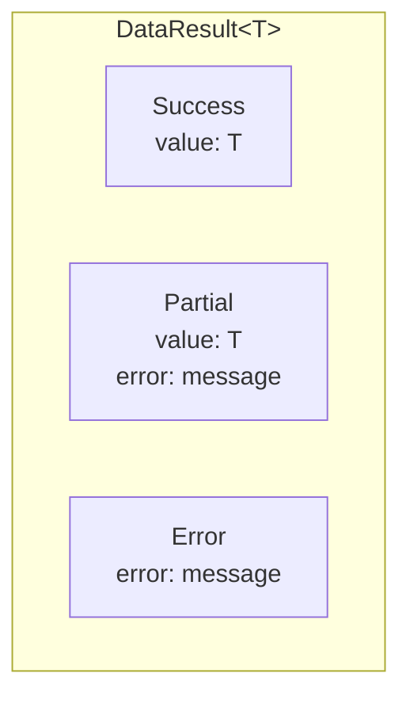

# DataResult

<show-structure for="chapter,procedure" depth="2"/>

<tldr>
    <p><code>DataResult&lt;T&gt;</code> is the framework's explicit, composable
       error-handling type. Every codec, dynamic read, and rewrite rule that can
       fail returns a <code>DataResult</code>, not a thrown exception. It represents
       <i>either a success</i>, <i>an error</i>, or <i>a partial result with an
       error attached</i>.</p>
</tldr>

## Shape



Three states, one type. The partial state matters &mdash; it lets a decoder emit
useful output even when the input is slightly off-spec.

## Constructing

```java
DataResult<String>  ok   = DataResult.success("value");
DataResult<Integer> bad  = DataResult.error("not a number");

// Partial: error, but with a usable fallback value
DataResult<Player> lenient = DataResult.error(
        "invalid level, defaulting to 1",
        new Player("Steve", 1)
);
```

## Reading

<tabs>
<tab title="Optional-style">

```java
DataResult<String> r = decode();

String value = r.result().orElse("fallback");

r.error().ifPresent(err -> log.warn(err.message()));
```

</tab>
<tab title="Boolean checks">

```java
if (r.isSuccess()) { ... }
if (r.isError())   { ... }
```

</tab>
<tab title="Throw on failure">

```java
String value = r.result().orElseThrow(
        () -> new IllegalStateException("expected value"));

// Or, with the error message threaded in:
String value = r.getOrThrow(msg -> new IllegalStateException(msg));
```

</tab>
<tab title="resultOrPartial">

```java
Optional<Player> player = r.resultOrPartial(
        err -> log.warn("decode error: {}", err));
```

Returns the success value, or the partial value, or empty &mdash; logging the
error as a side effect.

</tab>
</tabs>

## Transforming

<deflist type="full">
    <def title="map(fn)">
        Applies <code>fn</code> to the success value. Errors pass through untouched.
        <code>DataResult&lt;A&gt; → DataResult&lt;B&gt;</code>.
    </def>
    <def title="flatMap(fn)">
        Chain another <code>DataResult</code>-returning operation.
        <code>DataResult&lt;A&gt; → DataResult&lt;B&gt;</code>, collapsing nesting.
    </def>
    <def title="mapError(fn)">
        Rewrite the error message &mdash; useful for adding context before
        re-throwing upwards.
    </def>
    <def title="apply2 / apply3 / …">
        Combine multiple results: all must succeed, otherwise the first error wins.
    </def>
</deflist>

```java
DataResult<Integer> parsed = DataResult.success("42")
        .flatMap(s -> {
            try { return DataResult.success(Integer.parseInt(s)); }
            catch (NumberFormatException e) {
                return DataResult.error("not a number: " + s);
            }
        })
        .mapError(msg -> "parse failed: " + msg);
```

## Combining Results

```java
DataResult<String>  name  = DataResult.success("Steve");
DataResult<Integer> level = DataResult.success(10);

DataResult<Player> player = name.apply2(level, Player::new);
// Success(Player("Steve", 10))

DataResult<String> badName = DataResult.error("missing name");
DataResult<Player> failed  = badName.apply2(level, Player::new);
// Error("missing name")
```

## Where You Will See DataResult

- **Codecs** &mdash; every `encode` / `decode` returns a `DataResult`.
- **Dynamic reads** &mdash; `dyn.asString()` / `asInt()` / `asDouble()` etc.
- **DynamicOps** &mdash; `getStringValue`, `getNumberValue`, `getMapValues`, …
- **Type reads** &mdash; `type.read(dynamic)` returns `DataResult<Typed<?>>`.

```java
String name = dyn.get("name")
        .asString()
        .result()
        .orElse("Unknown");
```

## Best Practices

<deflist type="full">
    <def title="Default instead of throw">
        In migration code, prefer <code>.result().orElse(default)</code>.
        Exceptions escape through <code>DataFix.apply</code> and abort the whole
        migration &mdash; almost never what you want.
    </def>
    <def title="Add context with mapError">
        Before returning a <code>DataResult</code> from your own code, enrich the
        error message so callers can diagnose without digging through stack traces.
    </def>
    <def title="Use resultOrPartial for lenient reads">
        When a partial result is still useful, <code>resultOrPartial(logger)</code>
        lets you move on while still surfacing the issue.
    </def>
    <def title="Compose with flatMap, not nested ifs">
        <code>a.flatMap(this::step1).flatMap(this::step2)</code> reads better than
        a tower of <code>if (result.isSuccess()) …</code>.
    </def>
</deflist>

<seealso style="cards">
    <category ref="wrs">
        <a href="dynamic-system.md" summary="Where Dynamic reads return DataResult."/>
        <a href="codec-system.md" summary="Codecs surface decoding failures through DataResult."/>
    </category>
</seealso>
