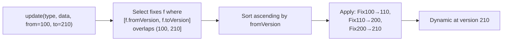

# DataFix System

<show-structure for="chapter,procedure" depth="2"/>

<tldr>
    <p>A <code>DataFix</code> is one forward migration step. A <code>DataFixer</code>
       holds the registry of fixes and walks the chain between any two
       <code>DataVersion</code>s. In practice, you extend <code>SchemaDataFix</code>
       and express the transformation as a composable <code>TypeRewriteRule</code>.</p>
</tldr>

## The Core Interfaces

<tabs>
<tab title="DataFix">

```java
public interface DataFix<T> {

    String      name();
    DataVersion fromVersion();
    DataVersion toVersion();

    Dynamic<T> apply(TypeReference type,
                     Dynamic<T>    input,
                     DataFixerContext context);
}
```

A `DataFix` declares its version range, a human-readable name, and how to
transform input data. The framework guarantees `input` is non-null and at
`fromVersion()`.

</tab>
<tab title="DataFixer">

```java
public interface DataFixer {

    DataVersion currentVersion();

    <T> Dynamic<T> update(TypeReference type,
                          Dynamic<T>    input,
                          DataVersion   from,
                          DataVersion   to);

    <T> Dynamic<T> update(TypeReference    type,
                          Dynamic<T>       input,
                          DataVersion      from,
                          DataVersion      to,
                          DataFixerContext context);
}
```

The orchestrator. Given a `TypeReference`, a `Dynamic<T>`, and a version range,
it picks the applicable fixes and applies them in ascending order.

</tab>
<tab title="FixRegistrar">

```java
public interface FixRegistrar {
    void register(TypeReference type, DataFix<?> fix);
}
```

Wires a `DataFix` to the `TypeReference` it acts on. Used only during the
bootstrap phase.

</tab>
</tabs>

## The Recommended Path: SchemaDataFix

`SchemaDataFix` sits in `%artifact_core%` and is the base class you will use 99%
of the time. It gives you access to the `inputSchema` and `outputSchema`, and
lets you declare the transformation as a `TypeRewriteRule`:

```java
public final class PlayerV1ToV2Fix extends SchemaDataFix {

    public PlayerV1ToV2Fix(SchemaRegistry schemas) {
        super("player_v100_to_v110",
                new DataVersion(100),
                new DataVersion(110),
                schemas);
    }

    @Override
    protected TypeRewriteRule makeRule(Schema inputSchema, Schema outputSchema) {
        return Rules.seq(
                Rules.renameField(GsonOps.INSTANCE, "playerName", "name"),
                Rules.renameField(GsonOps.INSTANCE, "xp",         "experience"),
                Rules.transformField(GsonOps.INSTANCE, "gameMode",
                        PlayerV1ToV2Fix::gameModeIntToString),
                groupPositionFieldsWithOptics()
        );
    }

    private static Dynamic<?> gameModeIntToString(Dynamic<?> v) {
        int m = v.asInt().result().orElse(0);
        return v.createString(switch (m) {
            case 1 -> "creative";
            case 2 -> "adventure";
            case 3 -> "spectator";
            default -> "survival";
        });
    }
}
```

<tip>
    <p>The rule-based approach plugs into the field-aware diagnostic system
       automatically &mdash; each rename / remove / transform is visible in the
       <code>MigrationReport</code> when you pass a <code>DiagnosticContext</code>.</p>
</tip>

## Implementing DataFix Directly

Sometimes you need behaviour the `Rules` combinators can't express &mdash; a
format-specific fast path, a cross-field invariant, a side-effecting log. In
that case, implement `DataFix<T>` directly:

```java
DataFix<JsonElement> fix = new DataFix<>() {

    @Override public String      name()        { return "rename_player_name"; }
    @Override public DataVersion fromVersion() { return new DataVersion(100); }
    @Override public DataVersion toVersion()   { return new DataVersion(110); }

    @Override
    public Dynamic<JsonElement> apply(TypeReference type,
                                      Dynamic<JsonElement> input,
                                      DataFixerContext ctx) {
        ctx.info("Renaming 'playerName' to 'name'");
        Dynamic<JsonElement> nameVal = input.get("playerName")
                .result().orElse(input.createString(""));
        return input.remove("playerName").set("name", nameVal);
    }
};
```

<warning>
    <p>Direct implementations bypass the field-aware diagnostics. Prefer
       <code>SchemaDataFix</code> and fall back to a raw <code>DataFix</code> only
       when you really need to.</p>
</warning>

## Bootstrap &amp; Create the Fixer

<procedure title="Wire fixes into a running fixer" id="wire-fixes">
    <step>
        <p>Implement <code>DataFixerBootstrap</code> with
           <code>registerSchemas</code> and <code>registerFixes</code>.</p>
    </step>
    <step>
        <p>In <code>registerSchemas</code>, build the schema chain and register each
           version.</p>
    </step>
    <step>
        <p>In <code>registerFixes</code>, bind every fix to its
           <code>TypeReference</code>.</p>
    </step>
    <step>
        <p>Create the fixer with
           <code>new DataFixerRuntimeFactory().create(currentVersion, bootstrap)</code>.</p>
    </step>
</procedure>

```java
public class GameDataBootstrap implements DataFixerBootstrap {

    public static final DataVersion CURRENT_VERSION = new DataVersion(200);

    private SchemaRegistry schemas;

    @Override
    public void registerSchemas(SchemaRegistry schemas) {
        this.schemas = schemas;
        Schema100 v100 = new Schema100();
        Schema110 v110 = new Schema110(v100);
        Schema200 v200 = new Schema200(v110);
        schemas.register(v100);
        schemas.register(v110);
        schemas.register(v200);
    }

    @Override
    public void registerFixes(FixRegistrar fixes) {
        fixes.register(TypeReferences.PLAYER, new PlayerV1ToV2Fix(schemas));
        fixes.register(TypeReferences.PLAYER, new PlayerV2ToV3Fix(schemas));
    }
}
```

```java
AetherDataFixer fixer = new DataFixerRuntimeFactory()
        .create(GameDataBootstrap.CURRENT_VERSION, new GameDataBootstrap());
```

## Applying Fixes

<tabs>
<tab title="With a Dynamic">

```java
Dynamic<JsonElement> dyn = new Dynamic<>(GsonOps.INSTANCE, rawJson);

Dynamic<JsonElement> migrated = fixer.update(
        TypeReferences.PLAYER,
        dyn,
        new DataVersion(100),
        fixer.currentVersion()
);
```

</tab>
<tab title="With a TaggedDynamic">

```java
TaggedDynamic tagged = new TaggedDynamic(TypeReferences.PLAYER,
        new Dynamic<>(GsonOps.INSTANCE, rawJson));

TaggedDynamic migrated = fixer.update(
        tagged,
        new DataVersion(100),
        fixer.currentVersion()
);

Dynamic<?> out = migrated.value();
```

`AetherDataFixer` exposes a convenience overload for code that already carries
its values as `TaggedDynamic`.

</tab>
<tab title="With diagnostics">

```java
DiagnosticContext diag = DiagnosticContext.create();

Dynamic<JsonElement> migrated = fixer.update(
        TypeReferences.PLAYER, dyn,
        new DataVersion(100), fixer.currentVersion(),
        diag
);

MigrationReport report = diag.getReport();
report.operations().forEach(System.out::println);
```

Diagnostics capture every field-aware operation the rules emitted &mdash; perfect
for audit logs, tests, or a user-facing migration summary.

</tab>
</tabs>

## How the Chain Is Picked



- Fixes are keyed by `TypeReference`; only fixes registered for `type` are
  considered.
- If `from >= to`, no fixes are applied and the input is returned as-is.
- Fixes for the same range are applied in registration order.

## Multi-Type Fixes

A single fix can emit a rule that touches multiple `TypeReference`s &mdash; useful
when a restructuring spans several data kinds.

```java
@Override
protected TypeRewriteRule makeRule(Schema in, Schema out) {
    return Rules.seq(
            Rules.renameField(GsonOps.INSTANCE, "hp", "health"),
            Rules.renameField(GsonOps.INSTANCE, "exp", "experience"),
            Rules.transformField(GsonOps.INSTANCE, "difficulty", this::intToName)
    );
}
```

## Best Practices

<deflist type="full">
    <def title="One fix per version step">
        <code>PlayerV1ToV2Fix</code>, <code>PlayerV2ToV3Fix</code> &mdash; keep each
        fix focused on a single hop. Chaining them at runtime is the framework's job.
    </def>
    <def title="Name fixes descriptively">
        Names show up in logs and diagnostic reports. Prefer
        <code>"player_v100_to_v110"</code> over <code>"fix1"</code>.
    </def>
    <def title="Keep fixes stateless">
        A fix may run concurrently on many data instances. Pure functions only.
    </def>
    <def title="Handle missing / malformed data gracefully">
        Use <code>asString().result().orElse("default")</code>, check for presence
        before dereferencing &mdash; the input may not match what the schema expected.
    </def>
    <def title="Test each fix in isolation">
        The <a href="starter-topic.md"><code>%artifact_testkit%</code></a> ships
        <code>DataFixTester</code> for exactly this.
    </def>
</deflist>

<seealso style="cards">
    <category ref="wrs">
        <a href="rewrite-rules.md" summary="The Rules DSL in full detail."/>
        <a href="schema-system.md" summary="Schemas are what a fix migrates between."/>
        <a href="dynamic-system.md" summary="Format-agnostic data manipulation inside rules."/>
    </category>
</seealso>
