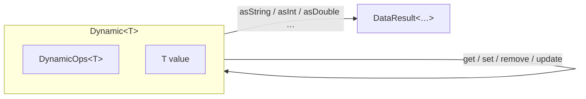

# Dynamic System

<show-structure for="chapter,procedure" depth="2"/>

<tldr>
    <p><code>Dynamic&lt;T&gt;</code> is a format-agnostic wrapper: it pairs a value
       with a <code>DynamicOps&lt;T&gt;</code> that knows how to read and write it.
       All migration code works through <code>Dynamic</code>, so the same fix logic
       runs against JSON, YAML, TOML, XML &mdash; or anything else you implement
       operations for.</p>
</tldr>

## The Wrapper



```java
Dynamic<JsonElement> dyn = new Dynamic<>(GsonOps.INSTANCE, json);

JsonElement raw    = dyn.value();   // back to the backing JsonElement
DynamicOps<?> ops  = dyn.ops();     // GsonOps.INSTANCE
```

## Creating Values

```java
// From existing data
Dynamic<JsonElement> fromJson = new Dynamic<>(GsonOps.INSTANCE, someElement);

// Build up from scratch
Dynamic<JsonElement> stats = fromJson
        .emptyMap()
        .set("health",     fromJson.createInt(100))
        .set("name",       fromJson.createString("Steve"))
        .set("active",     fromJson.createBoolean(true));

Dynamic<JsonElement> list = fromJson
        .emptyList()
        .append(fromJson.createString("a"))
        .append(fromJson.createString("b"));
```

## Reading Values

```java
// Navigate + convert in one line
String name = dyn.get("name").asString().result().orElse("Unknown");
int    lvl  = dyn.get("level").asInt().result().orElse(1);
double x    = dyn.get("position").get("x").asDouble().result().orElse(0.0);

// Presence check
boolean hasName = dyn.get("name").result().isPresent();
```

<note>
    <p>
        <code>dyn.get("name")</code> returns an <code>OptionalDynamic</code>, which
        safely chains further navigation and conversion. Failed conversions surface
        through <code>DataResult</code> rather than exceptions.
    </p>
</note>

## Modifying Values

`Dynamic` is **immutable**. Every mutation returns a new instance:

```java
Dynamic<?> updated = player
        .set("name",   player.createString("Alex"))
        .set("level",  player.createInt(20))
        .remove("obsolete");
```

### Nested updates

```java
// "Update at this key" is a one-call helper
Dynamic<?> levelled = player.update("level",
        lvl -> lvl.createInt(lvl.asInt().result().orElse(0) + 10));
```

### Lists

```java
Dynamic<?> inventory = player.get("inventory").orElseEmptyList();

// Walk the list
Stream<? extends Dynamic<?>> items = inventory.asStream().result().orElse(Stream.empty());

// Transform every element
Dynamic<?> doubled = inventory.updateList(item -> {
    int count = item.get("count").asInt().result().orElse(1);
    return item.set("count", item.createInt(count * 2));
});
```

### Maps

```java
Dynamic<?> stats = player.get("stats").orElseEmptyMap();
Dynamic<?> boosted = stats.updateMapValues((k, v) ->
        v.createInt(v.asInt().result().orElse(0) + 10));
```

## TaggedDynamic

`TaggedDynamic` pairs a `Dynamic<?>` with the `TypeReference` that describes
it &mdash; useful when you want the type and the payload to travel together.

```java
TaggedDynamic tagged = new TaggedDynamic(TypeReferences.PLAYER,
        new Dynamic<>(GsonOps.INSTANCE, json));

TypeReference type = tagged.type();   // TypeReferences.PLAYER
Dynamic<?>    val  = tagged.value();

// AetherDataFixer offers a convenience update(TaggedDynamic, from, to)
TaggedDynamic migrated = fixer.update(tagged, new DataVersion(100), fixer.currentVersion());
```

## DynamicOps Implementations

All six ship in `%artifact_codec%`:

| Implementation    | Format | Backing type     | Package                                                     |
|-------------------|--------|------------------|-------------------------------------------------------------|
| `GsonOps`         | JSON   | `JsonElement`    | `codec.json.gson`                                           |
| `JacksonJsonOps`  | JSON   | `JsonNode`       | `codec.json.jackson`                                        |
| `SnakeYamlOps`    | YAML   | `Object`         | `codec.yaml.snakeyaml`                                      |
| `JacksonYamlOps`  | YAML   | `JsonNode`       | `codec.yaml.jackson`                                        |
| `JacksonTomlOps`  | TOML   | `JsonNode`       | `codec.toml.jackson`                                        |
| `JacksonXmlOps`   | XML    | `JsonNode`       | `codec.xml.jackson`                                         |

### Custom DynamicOps

Implement the interface to add your own format. The contract is straightforward
&mdash; create primitive values, extract them, and expose map/list operations.

```java
public final class YamlOps implements DynamicOps<Object> {

    public static final YamlOps INSTANCE = new YamlOps();

    @Override public Object createString(String value)  { return value; }
    @Override public Object createInt(int value)        { return value; }
    // … and so on
}
```

## Common Recipes

<tabs>
<tab title="Safe extraction">

```java
String extractName(Dynamic<?> d) {
    return d.get("name").asString().result().orElse("Unknown");
}
```

</tab>
<tab title="Flatten nested position">

```java
Dynamic<?> flattenPosition(Dynamic<?> player) {
    Dynamic<?> pos = player.get("position").orElseEmptyMap();
    double x = pos.get("x").asDouble().result().orElse(0.0);
    double y = pos.get("y").asDouble().result().orElse(0.0);
    double z = pos.get("z").asDouble().result().orElse(0.0);
    return player.remove("position")
            .set("x", player.createDouble(x))
            .set("y", player.createDouble(y))
            .set("z", player.createDouble(z));
}
```

</tab>
<tab title="Convert int to string">

```java
Dynamic<?> modeToString(Dynamic<?> player) {
    int m = player.get("gameMode").asInt().result().orElse(0);
    return player.set("gameMode", player.createString(switch (m) {
        case 0 -> "survival";
        case 1 -> "creative";
        case 2 -> "adventure";
        case 3 -> "spectator";
        default -> "survival";
    }));
}
```

</tab>
</tabs>

## Best Practices

<deflist type="full">
    <def title="Always use .result().orElse(default)">
        Treat every <code>DataResult</code> read as fallible. Migrations run against
        real-world data that won&apos;t always match your expectations.
    </def>
    <def title="Chain immutable ops">
        <code>dyn.remove(...).set(...).set(...)</code> is clearer than a variable
        reassigned four times.
    </def>
    <def title="Preserve unknown fields">
        Pair <code>Dynamic</code> work with <code>DSL.remainder()</code> in your
        schemas so round-trips don&apos;t strip unmodeled data.
    </def>
    <def title="Return new values; don&apos;t mutate">
        The whole point of <code>Dynamic</code> is copy-on-write semantics. Resist the
        temptation to reach into the underlying <code>JsonElement</code>.
    </def>
</deflist>

<seealso style="cards">
    <category ref="wrs">
        <a href="codec-system.md" summary="Convert between typed Java objects and Dynamic."/>
        <a href="data-result.md" summary="How Dynamic reports failures."/>
        <a href="finder.md" summary="Finders for deep, path-aware access."/>
    </category>
</seealso>
