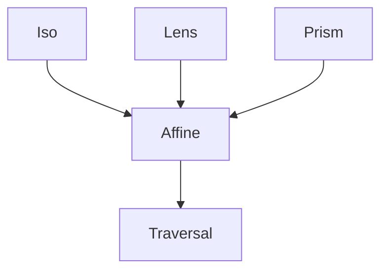

# Affine

<show-structure for="chapter,procedure" depth="2"/>

<tldr>
    <p>An <code>Affine&lt;S, T, A, B&gt;</code> combines a
       <a href="lens.md">Lens</a> and a <a href="prism.md">Prism</a>: it focuses
       on a field that may or may not be present. <code>getOption</code> returns
       an <code>Optional</code>; <code>set</code> updates the field when it
       exists.</p>
</tldr>

## Shape

```java
public interface Affine<S, T, A, B> {
    String           id();
    Optional<A>      getOption(S source);      // may be empty
    T                set(S source, B value);   // updates when present
    default T        modify(S, Function<A, B>);
}
```

Think of it as "a Lens that tolerates missing data". When the focus is
present, `Affine` behaves like a `Lens`. When it is absent, the source passes
through unchanged.

## Where Affine Sits In the Hierarchy



- A `Lens` automatically composes down to an `Affine` (it is just more
  permissive).
- A `Prism` does the same.
- An `Affine` composes up to a `Traversal` (zero-or-more is a superset of
  zero-or-one).

## Creating an Affine

<tabs>
<tab title="Optional field on a record">

```java
public record Person(String first, @Nullable String middle, String last) {
    public Person withMiddle(String m) { return new Person(first, m, last); }
}

Affine<Person, Person, String, String> middleName = Affine.of(
        "person.middle",
        p  -> Optional.ofNullable(p.middle()),
        (p, m) -> p.withMiddle(m)
);

Person withMiddle = new Person("Alice", "Marie", "Smith");
Person noMiddle   = new Person("Bob",   null,    "Jones");

middleName.getOption(withMiddle); // Optional["Marie"]
middleName.getOption(noMiddle);   // Optional.empty
```

</tab>
<tab title="From a Lens">

```java
Lens<Player, Player, String, String> nameLens = Lens.of(/* … */);

// Widen a Lens into an Affine that always succeeds.
Affine<Player, Player, String, String> nameAffine = Affine.fromLens(nameLens);
```

</tab>
</tabs>

## Reading and Writing

```java
middleName.getOption(alice); // Optional["Marie"]
middleName.set(alice, "Ann");
// new Person("Alice", "Ann", "Smith")

middleName.modify(bob, String::toUpperCase);
// bob unchanged: he has no middle name
```

<note>
    <p>
        Whether <code>set</code> <b>adds</b> a missing field or only updates an
        existing one is up to your implementation. The default contract is: if
        the focus is absent, <code>set</code> returns the source unchanged &mdash;
        if you need create-or-update semantics, encode that in the setter lambda.
    </p>
</note>

## Composition

```java
// Lens + Affine = Affine
Affine<Person, Person, Integer, Integer> middleLength =
        middleName.compose(Lens.of("string.length", String::length, (s, n) -> s));
```

Composition keeps the weaker of the two optics. If any step in the chain is
"maybe-there", the whole is an `Affine`.

## When to Choose Affine

<deflist type="full">
    <def title="Nullable record fields">
        A middle name, an optional nickname, a cached handle &mdash; everywhere a
        Lens would NPE.
    </def>
    <def title="Map values by key">
        The value <i>might</i> be under that key. If not, <code>getOption</code>
        returns empty.
    </def>
    <def title="Discriminated union with single payload">
        A <a href="prism.md">Prism</a> is more precise, but if all you need is
        maybe-here access, an Affine reads more naturally.
    </def>
    <def title="Upgrading a Prism to allow writes">
        Some sum-type variants expose a mutable field. Compose a Prism (pick the
        variant) with a Lens (focus the field) to get an Affine.
    </def>
</deflist>

## Affine vs. Lens vs. Prism

<compare type="top-bottom" first-title="Lens (total)" second-title="Affine (partial)">

```java
Lens<Player, Player, String, String> name = Lens.of(...);
String n = name.get(player);                 // must exist, no Optional
Player p = name.set(player, "Alex");         // always updates
```

```java
Affine<Person, Person, String, String> middle = Affine.of(...);
Optional<String> m = middle.getOption(person);    // maybe empty
Person updated     = middle.set(person, "Ann");    // no-op if absent
```

</compare>

- `Lens`: always one focus, mandatory.
- `Prism`: one variant, maybe present, structure changes on write.
- `Affine`: one focus, maybe present, same structure on write.

<seealso style="cards">
    <category ref="wrs">
        <a href="lens.md"        summary="The total version of this optic."/>
        <a href="prism.md"       summary="Variant matching (the other parent of Affine)."/>
        <a href="traversal.md"   summary="Scale up to zero-to-many focus."/>
        <a href="optics-overview.topic" summary="All optic types."/>
    </category>
</seealso>
