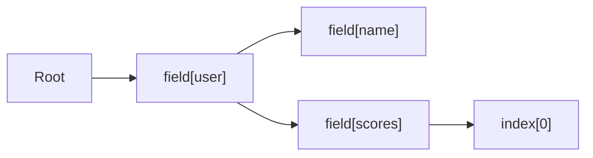

# Finder

<show-structure for="chapter,procedure" depth="2"/>

<tldr>
    <p><code>Finder&lt;A&gt;</code> is the runtime companion to the typed optics.
       It navigates <code>Dynamic&lt;?&gt;</code> values by <b>field name</b> and
       <b>list index</b>, composing into full paths. This is the optic you reach
       for inside a <a href="datafix-system.md">DataFix</a>.</p>
</tldr>

## Why a Separate Optic for Dynamic?

The other optics work on statically typed structures &mdash; Java records,
sealed classes, collections. `Dynamic` is deliberately untyped: its shape is
discovered at runtime. A Lens carved for one JSON shape would not work on YAML
or on a document that only partially matches the schema.

`Finder` solves that by operating on `Dynamic<?>` directly:

- `get` returns `Dynamic<?>` (may be `null` when the path does not exist).
- `getOptional` wraps the same result in an `Optional`.
- `set` returns a new `Dynamic<?>` with the value replaced at the target.
- `update` combines a read, a transform, and a write.
- `then` composes two Finders into a deeper path.

## Shape

```java
public interface Finder<A> {
    String                  id();
    @Nullable Dynamic<?>    get(Dynamic<?> root);
    default Optional<Dynamic<?>> getOptional(Dynamic<?> root);
    Dynamic<?>              set(Dynamic<?> root, Dynamic<?> newValue);
    default Dynamic<?>      update(Dynamic<?> root, Function<Dynamic<?>, Dynamic<?>> fn);
    default <B> Finder<B>   then(Finder<B> next);
}
```

## Factory Methods

<deflist type="full">
    <def title="Finder.field(String)">
        Navigates to a field by name in a map/object.
        <code>id</code> becomes <code>"field[name]"</code>.
    </def>
    <def title="Finder.index(int)">
        Navigates to an element by index in a list. Negative indexes are rejected
        at construction. Out-of-range positive indexes make <code>get</code>
        return <code>null</code> and <code>set</code> pass the root through
        unchanged.
    </def>
    <def title="Finder.identity()">
        Focuses on the root itself. Useful as a neutral element when you build a
        Finder from a variable path.
    </def>
    <def title="Finder.remainder(String...)">
        Focuses on "everything except these fields" &mdash; the sibling of
        <code>DSL.remainder()</code>. Handy when a fix needs to touch every
        unknown field at once.
    </def>
</deflist>

## Composition With `then`

```java
// JSON: {"user": {"name": "Alice", "scores": [85, 92, 78]}}
Finder<?> user        = Finder.field("user");
Finder<?> name        = Finder.field("name");
Finder<?> scores      = Finder.field("scores");
Finder<?> first       = Finder.index(0);

Finder<?> userName    = user.then(name);
Finder<?> firstScore  = user.then(scores).then(first);

userName.get(data);   // Dynamic("Alice")
firstScore.get(data); // Dynamic(85)
```



## Reading

<tabs>
<tab title="Nullable get">

```java
Dynamic<?> maybe = userName.get(data);
if (maybe == null) { /* path missing */ }
```

</tab>
<tab title="Optional-wrapped">

```java
Optional<Dynamic<?>> name = userName.getOptional(data);
String n = name.flatMap(d -> d.asString().result()).orElse("Unknown");
```

</tab>
<tab title="Typed reads through Dynamic">

```java
double x = Finder.field("position").then(Finder.field("x"))
        .getOptional(data)
        .flatMap(d -> d.asDouble().result())
        .orElse(0.0);
```

</tab>
</tabs>

## Writing

```java
// Simple replacement
Dynamic<?> renamed = userName.set(data, data.createString("Bob"));
// {"user": {"name": "Bob", "scores": [85, 92, 78]}}

// Read-modify-write in one call
Dynamic<?> doubled = firstScore.update(data, d ->
        d.createInt(d.asInt().result().orElse(0) * 2));
// {"user": {"name": "Alice", "scores": [170, 92, 78]}}
```

<tip>
    <p>
        <code>update</code> is the Finder's answer to
        <code>Lens.modify</code> &mdash; reads through the path, applies your
        function, writes the result back, all while preserving the surrounding
        shape.
    </p>
</tip>

## Finders Inside a DataFix

The example module's `PlayerV1ToV2Fix` uses Finders to extract `x`, `y`, `z`
from a flat V1.0.0 player before grouping them under a nested `position`
object:

```java
private static final Finder<?> X_FINDER = Finder.field("x");
private static final Finder<?> Y_FINDER = Finder.field("y");
private static final Finder<?> Z_FINDER = Finder.field("z");

private static double extractDouble(Finder<?> finder, Dynamic<?> dynamic) {
    return finder.getOptional(dynamic)
            .flatMap(d -> d.asDouble().result())
            .orElse(0.0);
}

private static TypeRewriteRule groupPositionFieldsWithOptics() {
    return dynamicTransform("groupPosition", dynamic -> {
        double x = extractDouble(X_FINDER, dynamic);
        double y = extractDouble(Y_FINDER, dynamic);
        double z = extractDouble(Z_FINDER, dynamic);

        var objDyn = (Dynamic<Object>) dynamic;
        var position = objDyn.emptyMap()
                .set("x", objDyn.createDouble(x))
                .set("y", objDyn.createDouble(y))
                .set("z", objDyn.createDouble(z));

        return objDyn.remove("x").remove("y").remove("z")
                .set("position", position);
    });
}
```

Declaring every path as a `static final Finder` at the top of the fix class is
a good habit &mdash; ids show up in migration reports, and accidental typos
are caught at class load time, not during the migration run.

## Null Handling Cheat Sheet

| Input state                               | `get` returns    | `set` result                              |
|-------------------------------------------|------------------|-------------------------------------------|
| Field exists                              | the `Dynamic<?>` | same root with the value replaced         |
| Field missing                             | `null`           | the field inserted (for `field`)          |
| List index within bounds                  | the element      | element replaced                          |
| List index beyond bounds (positive)       | `null`           | root unchanged                            |

Negative indices are rejected at `Finder.index` construction time with an
`IllegalArgumentException`.

## Finder vs. Lens vs. Affine

<compare type="top-bottom" first-title="Lens (typed)" second-title="Finder (Dynamic)">

```java
Lens<Player, Player, String, String> nameLens = Lens.of(...);
String n = nameLens.get(player);     // always there
```

```java
Finder<?> name = Finder.field("name");
Optional<Dynamic<?>> n = name.getOptional(dynamic);
```

</compare>

A `Finder` is closer to an <a href="affine.md">Affine</a> over `Dynamic<?>`
than it is to a `Lens` &mdash; the focus may be missing, and the types are
erased.

<seealso style="cards">
    <category ref="wrs">
        <a href="dynamic-system.md"  summary="The Dynamic API that Finders navigate."/>
        <a href="rewrite-rules.md"   summary="Path-aware rules built on Finder-like primitives."/>
        <a href="datafix-system.md"  summary="Real fixes using Finders in makeRule()."/>
        <a href="lens.md"               summary="The typed counterpart to Finder."/>
        <a href="optics-overview.topic"        summary="All optic types."/>
    </category>
</seealso>
