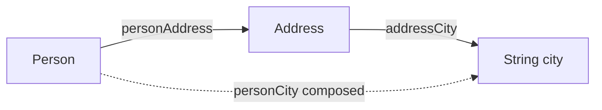

# Lens

<show-structure for="chapter,procedure" depth="2"/>

<tldr>
    <p>A <code>Lens&lt;S, T, A, B&gt;</code> focuses on <b>exactly one</b> part of
       a data structure. It provides both <code>get</code> and <code>set</code>,
       making it the workhorse optic for record-shaped data where the focus is
       guaranteed to exist.</p>
</tldr>

## Shape

```java
public interface Lens<S, T, A, B> {
    String id();
    A      get(S source);
    T      set(S source, B value);
    default T modify(S source, Function<A, B> fn);
}
```

The four type parameters cover polymorphic updates (changing the type of the
focus changes the type of the whole). In the common monomorphic case, you work
with the shorthand signature returned by `Lens.of(...)`:

```java
Lens<S, S, A, A>
```

&mdash; same source in and out, same focus in and out.

## The Lens Laws

A well-behaved Lens satisfies three laws. Your lenses should too.

<deflist type="full">
    <def title="Get-Set: setting back what you got is a no-op">
        <code>lens.set(s, lens.get(s)) == s</code>
    </def>
    <def title="Set-Get: getting after setting returns what you set">
        <code>lens.get(lens.set(s, v)) == v</code>
    </def>
    <def title="Set-Set: setting twice is the same as setting once">
        <code>lens.set(lens.set(s, v1), v2) == lens.set(s, v2)</code>
    </def>
</deflist>

Break a law and composition breaks in subtle, hard-to-debug ways.

## Creating a Lens

<tabs>
<tab title="From accessor + updater">

```java
public record Player(String name, int level) {
    public Player withName(String name)   { return new Player(name,  level); }
    public Player withLevel(int level)    { return new Player(this.name, level); }
}

Lens<Player, Player, String, String> playerName = Lens.of(
        "player.name",
        Player::name,
        (p, n) -> p.withName(n)
);

Lens<Player, Player, Integer, Integer> playerLevel = Lens.of(
        "player.level",
        Player::level,
        (p, l) -> p.withLevel(l)
);
```

</tab>
<tab title="With a builder lambda">

```java
Lens<Player, Player, Integer, Integer> playerLevel = Lens.of(
        "player.level",
        Player::level,
        Player::withLevel
);
```

</tab>
</tabs>

<tip>
    <p>Give every lens an <b>identifier that mirrors its path</b> &mdash;
       <code>"player.name"</code>, <code>"order.customer.address.city"</code>.
       Composed lenses concatenate their ids with <code>.</code>, so names stay
       readable in diagnostics.</p>
</tip>

## Reading, Writing, Modifying

```java
Player p = new Player("steve", 10);

String name = playerName.get(p);          // "steve"

Player renamed = playerName.set(p, "Alex");      // Player("Alex", 10)
Player upper   = playerName.modify(p, String::toUpperCase); // Player("STEVE", 10)

Player levelled = playerLevel.modify(p, l -> l + 5); // Player("steve", 15)
```

`modify` is syntactic sugar for `set(source, fn.apply(get(source)))` but saves
the intermediate variable.

## Composition

`lensA.compose(lensB)` drills from the outer source through to the inner
focus. The composed Lens inherits the union of both lenses' behaviour.

```java
public record Address(String street, String city) {
    public Address withCity(String city) { return new Address(street, city); }
}
public record Person(String name, Address address) {
    public Person withAddress(Address a) { return new Person(name, a); }
}

Lens<Person,  Person,  Address, Address> personAddress = Lens.of(
        "person.address",
        Person::address,
        Person::withAddress
);

Lens<Address, Address, String,  String>  addressCity   = Lens.of(
        "address.city",
        Address::city,
        Address::withCity
);

Lens<Person, Person, String, String> personCity = personAddress.compose(addressCity);
// id = "person.address.city"

Person alice = new Person("Alice", new Address("Main St", "Berlin"));
String city   = personCity.get(alice);               // "Berlin"
Person moved  = personCity.set(alice, "Hamburg");    // Address.city swapped
```



## Use It Where You Really Need It

<deflist type="full">
    <def title="Yes: deeply nested, always-present fields">
        A Lens earns its keep when the focus is guaranteed to exist and you need
        ergonomic updates deep inside a record tree.
    </def>
    <def title="No: optional fields">
        Reach for an <a href="affine.md">Affine</a> or a
        <a href="prism.md">Prism</a> &mdash; a Lens assumes the value is there.
    </def>
    <def title="No: collections">
        Use a <a href="traversal.md">Traversal</a> for zero-to-many focus.
    </def>
    <def title="No: Dynamic data">
        For migration code working with <code>Dynamic&lt;?&gt;</code>, use a
        <a href="finder.md">Finder</a> &mdash; it handles the runtime shape.
    </def>
</deflist>

## Downgrading to a Getter

If an API needs read-only access, project the Lens:

```java
Getter<Player, String> nameGetter = Getter.fromLens(playerName);
```

## Lens vs. Plain Field Access

<compare type="top-bottom" first-title="Manual nested update" second-title="Composed lens">

```java
Person updated = new Person(
        alice.name(),
        new Address(
                alice.address().street(),
                "Hamburg"   // the bit that actually changed
        )
);
```

```java
Person updated = personCity.set(alice, "Hamburg");
```

</compare>

The lens wins as soon as you have more than one level of nesting, and the gap
widens the deeper you go.

<seealso style="cards">
    <category ref="wrs">
        <a href="getter.md"    summary="Read-only projection of a Lens."/>
        <a href="iso.md"       summary="Bidirectional Lens-like conversion."/>
        <a href="affine.md"    summary="A Lens for fields that may be absent."/>
        <a href="traversal.md" summary="Scale from one focus to many."/>
        <a href="optics-overview.topic" summary="All optic types."/>
    </category>
</seealso>
