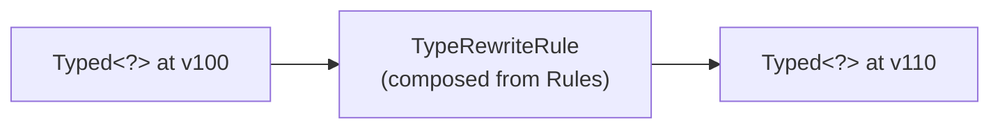

# Rewrite Rules

<show-structure for="chapter,procedure" depth="2"/>

<tldr>
    <p>A <code>TypeRewriteRule</code> is a single transformation. The
       <code>Rules</code> factory assembles rules from building blocks &mdash; field
       renames, transforms, removes, conditional logic, and combinators &mdash; that
       compose into arbitrarily complex migrations.</p>
</tldr>

## How Rules Fit In

A `SchemaDataFix` returns a `TypeRewriteRule` from `makeRule()`. The framework
applies the rule to every value of the fix's registered `TypeReference` and
hands the result to the next fix in the chain.



Almost every rule in the factory takes a `DynamicOps<T>` as its first argument.
That's what lets the rule encode and decode back through the format the rest of
the migration is using.

## The Workhorse Combinator: `Rules.seq`

Applies the given rules in order. Later rules see the output of earlier ones.

```java
Rules.seq(
        Rules.renameField(GsonOps.INSTANCE, "oldName", "newName"),
        Rules.transformField(GsonOps.INSTANCE, "newName", this::normalize),
        Rules.addField(GsonOps.INSTANCE, "version", d -> d.createInt(2))
)
```

<warning>
    <p>Order matters inside <code>seq</code>. Rename first, <i>then</i> transform
       under the new name &mdash; the rule chain is linear, not declarative.</p>
</warning>

## Field-Level Rules (single field)

<tabs>
<tab title="renameField">

```java
Rules.renameField(GsonOps.INSTANCE, "playerName", "name");
// {"playerName": "Steve"} → {"name": "Steve"}
```

</tab>
<tab title="removeField">

```java
Rules.removeField(GsonOps.INSTANCE, "legacyScore");
// {"name": "X", "legacyScore": 100, "score": 150}
//   → {"name": "X", "score": 150}
```

</tab>
<tab title="addField">

```java
Rules.addField(GsonOps.INSTANCE, "version", d -> d.createInt(2));
// {"name": "X"} → {"name": "X", "version": 2}
```

</tab>
<tab title="setField">

```java
Rules.setField(GsonOps.INSTANCE, "mode", d -> d.createString("survival"));
// Overwrites any existing "mode", adding it if absent.
```

</tab>
<tab title="transformField">

```java
Rules.transformField(GsonOps.INSTANCE, "gameMode", value -> {
    int m = value.asInt().result().orElse(0);
    return value.createString(switch (m) {
        case 1 -> "creative";
        case 2 -> "adventure";
        case 3 -> "spectator";
        default -> "survival";
    });
});
```

</tab>
</tabs>

## Batch Helpers (multiple fields)

| Method                        | Transforms                                                  |
|-------------------------------|-------------------------------------------------------------|
| `Rules.renameFields(ops, map)`| Rename multiple fields in one rule                          |
| `Rules.removeFields(ops, …)`  | Remove a list of fields                                     |
| `Rules.groupFields(ops, …)`   | Wrap a flat set of fields inside a nested object            |
| `Rules.flattenField(ops, f)`  | Unwrap a nested object's fields into its parent             |
| `Rules.moveField(ops, a, b)`  | Move a value from source path to target path                |
| `Rules.copyField(ops, a, b)`  | Copy (rather than move) a value                             |

```java
Rules.seq(
        Rules.renameFields(GsonOps.INSTANCE, Map.of(
                "playerName", "name",
                "xp",         "experience"
        )),
        Rules.groupFields(GsonOps.INSTANCE, "position", "x", "y", "z"),
        Rules.removeFields(GsonOps.INSTANCE, "oldFlag", "debug")
);
```

## Nested Paths

Every field-level rule has a path-aware twin that targets a dot-delimited path:

| Root rule              | Path variant                  |
|------------------------|-------------------------------|
| `transformField`       | `transformFieldAt`            |
| `renameField`          | `renameFieldAt`               |
| `removeField`          | `removeFieldAt`               |
| `addField`             | `addFieldAt`                  |

```java
Rules.renameFieldAt(GsonOps.INSTANCE, "player.position.world", "dimension");
```

## Conditional Rules

<tabs>
<tab title="ifFieldExists">

```java
Rules.ifFieldExists(GsonOps.INSTANCE, "legacy",
        Rules.transformField(GsonOps.INSTANCE, "legacy", this::migrateLegacy));
```

</tab>
<tab title="ifFieldMissing">

```java
Rules.ifFieldMissing(GsonOps.INSTANCE, "version",
        Rules.setField(GsonOps.INSTANCE, "version", d -> d.createInt(1)));
```

</tab>
<tab title="ifFieldEquals">

```java
Rules.ifFieldEquals(GsonOps.INSTANCE, "tier", "legacy",
        Rules.transform(GsonOps.INSTANCE, "migrate_legacy", this::rewriteLegacyTier));
```

</tab>
<tab title="conditionalTransform">

```java
Rules.conditionalTransform(GsonOps.INSTANCE,
        d -> d.get("health").asInt().result().orElse(0) < 0,
        d -> d.set("health", d.createInt(0)));
```

</tab>
</tabs>

## Combinators

<deflist type="full">
    <def title="Rules.seq(rules...)">
        Apply in order. Stops at the first failure in strict mode.
    </def>
    <def title="Rules.seqAll(rules...)">
        Apply all, collecting errors rather than short-circuiting.
    </def>
    <def title="Rules.choice(rules...)">
        Try each rule in order; the first one that successfully transforms wins.
    </def>
    <def title="Rules.all(rule)">
        Lift a rule so it traverses every child of a composite type.
    </def>
    <def title="Rules.one(rule)">
        Apply to exactly one child of a composite type.
    </def>
    <def title="Rules.everywhere(rule)">
        Apply recursively at every node &mdash; useful for whole-tree renames.
    </def>
    <def title="Rules.bottomUp(rule) / topDown(rule)">
        Traversal strategy variants for recursive transformation.
    </def>
    <def title="Rules.tryOnce(rule) / checkOnce(rule)">
        Apply at most once (guard against repeated application).
    </def>
    <def title="Rules.noop() / log(message)">
        A no-op and a logging-only rule &mdash; great for diagnostics in a
        <code>seq</code> pipeline.
    </def>
</deflist>

## A Complete Fix

Taken from the example module and lightly annotated:

```java
public final class PlayerV1ToV2Fix extends SchemaDataFix {

    public PlayerV1ToV2Fix(SchemaRegistry schemas) {
        super("player_v100_to_v110",
                new DataVersion(100),
                new DataVersion(110),
                schemas);
    }

    @Override
    protected TypeRewriteRule makeRule(Schema in, Schema out) {
        return Rules.seq(
                // 1. Simple renames
                Rules.renameField(GsonOps.INSTANCE, "playerName", "name"),
                Rules.renameField(GsonOps.INSTANCE, "xp",         "experience"),

                // 2. Transform a single field's value
                Rules.transformField(GsonOps.INSTANCE, "gameMode",
                        PlayerV1ToV2Fix::gameModeIntToString),

                // 3. Group flat coords under a nested object
                Rules.groupFields(GsonOps.INSTANCE, "position", "x", "y", "z")
        );
    }

    private static Dynamic<?> gameModeIntToString(Dynamic<?> value) {
        int m = value.asInt().result().orElse(0);
        return value.createString(switch (m) {
            case 1 -> "creative";
            case 2 -> "adventure";
            case 3 -> "spectator";
            default -> "survival";
        });
    }
}
```

## Rules At a Glance

| Need                           | Reach for                                            |
|--------------------------------|------------------------------------------------------|
| Rename a field                 | `renameField` / `renameFields` / `renameFieldAt`     |
| Remove a field                 | `removeField` / `removeFields` / `removeFieldAt`     |
| Add a new field                | `addField` / `addFieldAt` / `setField`               |
| Transform a single value       | `transformField` / `transformFieldAt`                |
| Move data around               | `moveField` / `copyField` / `groupFields` / `flattenField` |
| Arbitrary transformation       | `dynamicTransform(name, ops, fn)`                    |
| Conditional migration          | `ifFieldExists` / `ifFieldMissing` / `ifFieldEquals` / `conditionalTransform` |
| Sequence of rules              | `seq` / `seqAll`                                     |
| Pick the first rule that works | `choice`                                             |
| Recursive traversal            | `all` / `one` / `everywhere` / `bottomUp` / `topDown`|
| Diagnostics                    | `log(message)` / `noop()`                            |

## Best Practices

<deflist type="full">
    <def title="Prefer batch helpers for batch work">
        <code>renameFields(map)</code> beats a long <code>seq</code> of individual
        renames &mdash; it also reports more accurately in the migration report.
    </def>
    <def title="Use path-aware variants for nested data">
        <code>transformFieldAt("player.position.x", fn)</code> beats three levels of
        manual navigation.
    </def>
    <def title="Make conditions cheap">
        <code>ifFieldExists</code> and <code>ifFieldMissing</code> are guards, not
        filters &mdash; run the heavy logic inside the rule, not inside the predicate.
    </def>
    <def title="Write pure transformation functions">
        Rules may run concurrently. No state, no side effects beyond the produced
        <code>Dynamic</code>.
    </def>
</deflist>

<seealso style="cards">
    <category ref="wrs">
        <a href="datafix-system.md" summary="Where rules are applied."/>
        <a href="dynamic-system.md" summary="The Dynamic API your rule code uses."/>
        <a href="finder.md" summary="Finder optics for path-aware access inside rules."/>
    </category>
</seealso>
