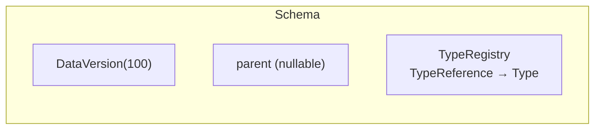
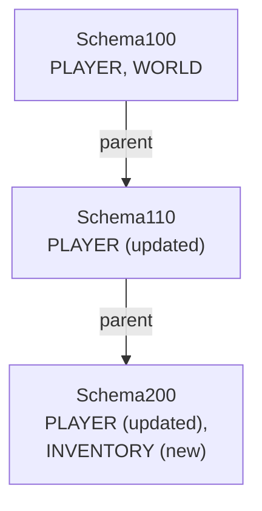

# Schema System

<show-structure for="chapter,procedure" depth="2"/>

<tldr>
    <p>A <code>Schema</code> is the <b>type definition for a specific
       <code>DataVersion</code></b>. It pairs that version with a
       <code>TypeRegistry</code> mapping each <code>TypeReference</code> to a
       <code>Type</code>. Schemas form an inheritance chain &mdash; a child only
       registers the types that changed from its parent.</p>
</tldr>

## Mental Model



Every fixer holds a chain of schemas &mdash; one per `DataVersion` &mdash; that a
`DataFix` can consult when it needs to know the shape of its input or output.

## Two Ways to Build a Schema

<tabs>
<tab title="Subclass (recommended)">

The canonical pattern: extend `Schema`, pass `(int versionId, Schema parent)` to
the protected constructor, override `createTypeRegistry()` to choose a registry,
and override `registerTypes()` to register types using the DSL.

```java
import de.splatgames.aether.datafixers.api.dsl.DSL;
import de.splatgames.aether.datafixers.api.schema.Schema;
import de.splatgames.aether.datafixers.api.type.TypeRegistry;
import de.splatgames.aether.datafixers.core.type.SimpleTypeRegistry;

public class Schema100 extends Schema {

    public Schema100() {
        super(100, null);               // version 1.0.0, no parent
    }

    @Override
    protected TypeRegistry createTypeRegistry() {
        return new SimpleTypeRegistry();
    }

    @Override
    protected void registerTypes() {
        registerType(TypeReferences.PLAYER, DSL.and(
                DSL.field("name",   DSL.string()),
                DSL.field("level",  DSL.intType()),
                DSL.remainder()
        ));
    }
}
```

> Types are registered **lazily** on the first call to <code>schema.types()</code>.
> The initialisation is thread-safe &mdash; concurrent callers observe a fully
> populated registry.
> {style="note"}

</tab>
<tab title="Direct construction">

For simple cases (or generated schemas) you can hand a pre-populated
`TypeRegistry` to the public constructor:

```java
TypeRegistry types = new SimpleTypeRegistry();
types.register(new SimpleType<>(TypeReferences.PLAYER, playerCodec));

Schema schema = new Schema(new DataVersion(100), types);
```

No inheritance, no lazy init &mdash; the registry is ready the moment the schema
is constructed.

</tab>
</tabs>

## Schema Inheritance

Child schemas inherit every type from their parent; the child only needs to
register types that changed.



### Example chain

```java
public class Schema110 extends Schema {

    public Schema110(Schema parent) {
        super(110, parent);             // inherits WORLD unchanged
    }

    @Override
    protected TypeRegistry createTypeRegistry() {
        return new SimpleTypeRegistry();
    }

    @Override
    protected void registerTypes() {
        // Only re-register types that actually changed from Schema100.
        registerType(TypeReferences.PLAYER, DSL.and(
                DSL.field("name",       DSL.string()),
                DSL.field("level",      DSL.intType()),
                DSL.field("experience", DSL.intType()),          // new
                DSL.field("position",   position()),             // restructured
                DSL.remainder()
        ));
    }

    public static TypeTemplate position() {
        return DSL.and(
                DSL.field("x", DSL.doubleType()),
                DSL.field("y", DSL.doubleType()),
                DSL.field("z", DSL.doubleType())
        );
    }
}
```

## Registering Schemas in the Bootstrap

<procedure title="Wire a schema chain" id="schema-chain">
    <step>
        <p>Create the first schema with <code>null</code> as its parent.</p>
    </step>
    <step>
        <p>For every subsequent version, pass the previous schema as the parent.</p>
    </step>
    <step>
        <p>Register each schema with the <code>SchemaRegistry</code>.</p>
    </step>
</procedure>

```java
public class GameDataBootstrap implements DataFixerBootstrap {

    public static final DataVersion CURRENT_VERSION = new DataVersion(200);

    @Override
    public void registerSchemas(SchemaRegistry schemas) {
        Schema100 v100 = new Schema100();
        Schema110 v110 = new Schema110(v100);
        Schema200 v200 = new Schema200(v110);

        schemas.register(v100);
        schemas.register(v110);
        schemas.register(v200);
    }

    @Override
    public void registerFixes(FixRegistrar fixes) {
        // fixes go here
    }
}
```

## Type Lookup

```java
Type<?> playerType = schema.require(TypeReferences.PLAYER);
```

<warning>
    <p>
        <code>require</code> throws <code>IllegalStateException</code> when the type
        is not registered at the given version. Use <code>schema.types().get(ref)</code>
        if you need the nullable variant.
    </p>
</warning>

## Best Practices

<deflist type="full">
    <def title="One schema class per version">
        Name them after the version &mdash; <code>Schema100</code>, <code>Schema110</code>,
        <code>Schema200</code>.
    </def>
    <def title="Document the delta">
        Keep a Javadoc block on each subclass listing exactly what changed from the
        parent. Future-you will thank past-you.
    </def>
    <def title="Extract reusable templates">
        Move repeated shapes (positions, item stacks, vectors) into static DSL helpers
        so multiple schemas can share them.
    </def>
    <def title="Always include remainder()">
        <code>DSL.remainder()</code> preserves unknown fields. Without it, anything not
        explicitly typed is dropped during codec round-trips.
    </def>
    <def title="Never mutate a released schema">
        Once data tagged with <code>Schema100</code> exists in the wild, its structure
        is frozen forever. If you need to change it, create <code>Schema101</code>.
    </def>
</deflist>

## Cheat Sheet

| API                                            | Purpose                                                |
|------------------------------------------------|--------------------------------------------------------|
| `new Schema(DataVersion, TypeRegistry)`        | Direct construction from a pre-built registry.         |
| `super(int, Schema)` (protected)               | Subclass constructor: version id + parent (nullable).  |
| `protected TypeRegistry createTypeRegistry()`  | Choose a registry implementation (usually `SimpleTypeRegistry`). |
| `protected void registerTypes()`               | Register types for this version using the DSL.         |
| `registerType(Type)` / `registerType(ref, tmpl)` | Add a type to the registry (only during `registerTypes`). |
| `schema.version()`                             | The `DataVersion` this schema represents.              |
| `schema.parent()`                              | The parent schema, or `null`.                          |
| `schema.types()`                               | The fully populated `TypeRegistry` (lazy).             |
| `schema.require(ref)`                          | Type lookup; throws if absent.                         |

<seealso style="cards">
    <category ref="wrs">
        <a href="type-system.md" summary="Type and TypeRegistry in depth."/>
        <a href="dsl.md" summary="DSL reference for type templates."/>
        <a href="datafix-system.md" summary="Using schemas from inside a fix."/>
    </category>
</seealso>
