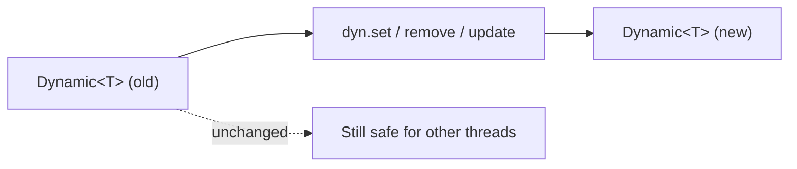

# Thread Safety

<show-structure for="chapter,procedure" depth="2"/>

<tldr>
    <p>%product% is designed for concurrent use. Core types are immutable,
       <code>AetherDataFixer</code> is safe to share across threads, and
       <code>Dynamic</code> operations return new values rather than mutating in
       place. The only per-call object you must <b>not</b> share is a
       <code>DataFixerContext</code>.</p>
</tldr>

## Guarantees At A Glance

| Component                      | Thread-safety guarantee                                            |
|--------------------------------|--------------------------------------------------------------------|
| `DataVersion`                  | Immutable &mdash; share freely.                                    |
| `TypeReference`                | Immutable &mdash; share freely.                                    |
| `Schema`                       | Effectively immutable once initialised. Lazy type registry init is synchronised.|
| `TypeRegistry` (SimpleTypeRegistry) | Thread-safe for reads after bootstrap. Registration happens once, inside `registerTypes()`. |
| `AetherDataFixer`              | Thread-safe for concurrent <code>update</code> calls on different data instances. |
| `DataFix` implementations      | Must be stateless or otherwise safe &mdash; see below.             |
| `Dynamic<T>`                   | Immutable; every transformation returns a new instance.            |
| `DataResult<T>`                | Immutable.                                                         |
| `TaggedDynamic`                | Immutable.                                                         |
| `DataFixerContext`             | <b>Per-migration.</b> Never share between concurrent calls.        |

## Why Immutability?



Because every operation produces a new value, two threads can safely transform
the same input at the same time without locking or copying upfront. This is the
foundation that lets a single `AetherDataFixer` serve a whole application.

## Sharing the Fixer

<procedure title="Safe patterns for sharing a fixer" id="sharing-fixer">
    <step>
        <p>Build one <code>AetherDataFixer</code> at application startup.</p>
    </step>
    <step>
        <p>Hold it in a singleton, a dependency-injection container, or an
           application-scoped field.</p>
    </step>
    <step>
        <p>Call <code>update</code> concurrently from any number of threads.</p>
    </step>
</procedure>

```java
public final class MigrationService {

    private static final AetherDataFixer FIXER =
            new DataFixerRuntimeFactory()
                    .create(GameDataBootstrap.CURRENT_VERSION, new GameDataBootstrap());

    public Dynamic<JsonElement> migrate(Dynamic<JsonElement> input, DataVersion from) {
        return FIXER.update(TypeReferences.PLAYER, input, from, FIXER.currentVersion());
    }
}
```

## Writing Thread-Safe Fixes

<deflist type="full">
    <def title="No instance state">
        A <code>DataFix</code> is a pure transformation. Reject mutable fields; do not
        keep counters, caches, or <code>Dynamic</code> references in instance variables.
    </def>
    <def title="Stateless helpers">
        Declare helper methods as <code>static</code> or as pure instance methods with
        no shared state.
    </def>
    <def title="Share immutable context safely">
        Reading the <code>SchemaRegistry</code> you were constructed with is fine.
        Never write to it outside the bootstrap phase.
    </def>
</deflist>

<tabs>
<tab title="Safe">

```java
public class SafeFix extends SchemaDataFix {

    @Override
    protected TypeRewriteRule makeRule(Schema in, Schema out) {
        return Rules.transformField(GsonOps.INSTANCE, "mode", SafeFix::normalize);
    }

    private static Dynamic<?> normalize(Dynamic<?> value) {
        int m = value.asInt().result().orElse(0);
        return value.createString(m == 1 ? "creative" : "survival");
    }
}
```

</tab>
<tab title="Unsafe">

```java
public class UnsafeFix extends SchemaDataFix {

    private int runCount = 0; // mutable instance state — RACE CONDITION
    private Dynamic<?> cached; // do not cache Dynamic references across calls

    @Override
    protected TypeRewriteRule makeRule(Schema in, Schema out) {
        return Rules.transform(GsonOps.INSTANCE, "unsafe", d -> {
            runCount++;       // not thread-safe
            cached = d;       // leaks state between migrations
            return d;
        });
    }
}
```

</tab>
</tabs>

## DataFixerContext Is Per-Call

`DataFixerContext` &mdash; and its diagnostic subclass `DiagnosticContext` &mdash;
collect per-migration logs and reports. Each concurrent call must pass its own
context:

```java
void migrateMany(List<Dynamic<JsonElement>> items) {
    items.parallelStream().forEach(item -> {
        DiagnosticContext ctx = DiagnosticContext.create();   // fresh per thread
        FIXER.update(TypeReferences.PLAYER, item, v100, v200, ctx);
        persistReport(ctx.getReport());
    });
}
```

<warning>
    <p>A shared <code>DiagnosticContext</code> will interleave reports from concurrent
       migrations and may corrupt them. Always create one per call.</p>
</warning>

## Schemas and Lazy Initialisation

`Schema` subclasses that use the `super(int versionId, Schema parent)`
constructor build their type registry lazily on first call to `schema.types()`.
The double-checked locking inside `Schema` is safe: concurrent callers will see
a fully populated registry once initialisation finishes.

You don't need to do anything special &mdash; just avoid triggering
`registerTypes()` from multiple threads before the fixer is built.

## Summary

<deflist type="full">
    <def title="Default to sharing">
        The fixer is built once; every read-only type is shareable.
    </def>
    <def title="Never share DataFixerContext">
        Create one per migration call, especially for diagnostics.
    </def>
    <def title="Keep fixes pure">
        No instance state, no shared mutable caches. Parallel migrations will find
        the first unsafe spot instantly.
    </def>
    <def title="Trust immutability">
        Don&apos;t clone <code>Dynamic</code> values defensively &mdash; operations
        already copy on write.
    </def>
</deflist>

<seealso style="cards">
    <category ref="wrs">
        <a href="architecture.md" summary="How the fixer, schemas, and fixes fit together."/>
        <a href="datafix-system.md" summary="The contract every fix must honour."/>
    </category>
</seealso>
