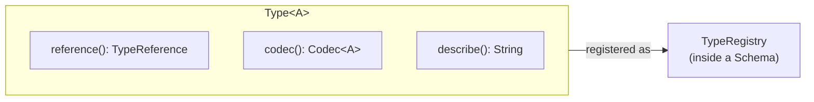

# Type System

<show-structure for="chapter,procedure" depth="2"/>

<tldr>
    <p>A <code>Type&lt;A&gt;</code> couples a <code>TypeReference</code> with a
       <code>Codec&lt;A&gt;</code>, giving the framework enough information to
       encode, decode, and describe values of that type. A
       <code>TypeRegistry</code> maps <code>TypeReference</code> &rarr;
       <code>Type</code> inside a <code>Schema</code>.</p>
</tldr>

## Mental Model



## The Type Interface

```java
public interface Type<A> {

    TypeReference reference();

    Codec<A> codec();

    String describe();              // human-readable for logs / errors
}
```

Every `Type` knows its identity (`reference()`), how to serialise itself
(`codec()`), and a short description for diagnostics (`describe()`). Composite
types (list, product, sum, …) additionally expose their children.

## Built-in Primitives

`Type` declares a ready-made constant for every primitive value the framework
understands:

| Constant              | Java type  |
|-----------------------|------------|
| `Type.BOOL`           | `Boolean`  |
| `Type.BYTE`           | `Byte`     |
| `Type.SHORT`          | `Short`    |
| `Type.INT`            | `Integer`  |
| `Type.LONG`           | `Long`     |
| `Type.FLOAT`          | `Float`    |
| `Type.DOUBLE`         | `Double`   |
| `Type.STRING`         | `String`   |
| `Type.PASSTHROUGH`    | `Dynamic<?>` &mdash; preserved as-is during migration |

<tip>
    <p><code>Type.PASSTHROUGH</code> is the right choice for fields whose structure is
       unknown, optional, or forward-compatible &mdash; it keeps the value verbatim
       without parsing it.</p>
</tip>

## Creating Custom Types

You rarely build a `Type` by hand. In the common path you register a
<a href="dsl.md">DSL template</a> against a `TypeReference`:

```java
@Override
protected void registerTypes() {
    registerType(TypeReferences.PLAYER, DSL.and(
            DSL.field("name",  DSL.string()),
            DSL.field("level", DSL.intType()),
            DSL.remainder()
    ));
}
```

Under the hood, `registerType(TypeReference, TypeTemplate)` applies the template
and wraps the resulting `Type<?>` so it reports your reference from
`reference()`. If you need total control, call
`Type.primitive("my-type", myCodec)` to wrap any `Codec<A>` into a `Type<A>`.

## TypeRegistry

`TypeRegistry` holds every `Type` valid at a given schema version.

```java
public interface TypeRegistry {

    void register(Type<?> type);

    @Nullable Type<?> get(TypeReference ref);

    boolean has(TypeReference ref);

    Type<?> require(TypeReference ref);   // throws if missing

    Set<TypeReference> references();
}
```

The stock implementation is `SimpleTypeRegistry` from the core module. Most code
never touches it directly: schemas pick one via `createTypeRegistry()`, and
lookups go through `schema.require(ref)`.

## Typed&lt;A&gt;

`Typed<A>` pairs a value with the `Type<A>` it inhabits. Rule combinators in the
`Rules` DSL read and return `Typed<?>` instances &mdash; this is what lets rules
re-encode their outputs through the correct codec without guessing.

```java
Typed<Player> typedPlayer = ...;
Type<Player> type  = (Type<Player>) typedPlayer.type();
Player       value = typedPlayer.value();
```

You will most often see `Typed` in custom `TypeRewriteRule` implementations. If
you are composing rules via `Rules`, you do not need to construct `Typed` values
yourself.

## TypeFamily

`TypeFamily` is the context object used when a `TypeTemplate` is instantiated.
It resolves references to other types, enabling recursive and cross-referencing
templates. For day-to-day use, `DSL.and(...).apply(TypeFamily.empty())` is
enough.

## Composite Types at a Glance

These are produced by DSL templates and form the structure of most domain
objects:

<deflist type="full">
    <def title="product (and)">
        A record-like pairing of fields, e.g. <code>DSL.and(field("x",...), field("y",...))</code>.
    </def>
    <def title="list">
        Homogeneous list of an inner type &mdash; <code>DSL.list(DSL.string())</code>.
    </def>
    <def title="optional">
        A value that may be absent &mdash; <code>DSL.optional("nickname", DSL.string())</code>.
    </def>
    <def title="taggedChoice (sum)">
        Discriminated union. A <i>tag</i> field selects which inner template to decode
        against &mdash; <code>DSL.taggedChoice("type", DSL.string(), Map.of(...))</code>.
    </def>
    <def title="remainder">
        Captures unknown fields so they survive codec round-trips. Almost every record
        should end with <code>DSL.remainder()</code>.
    </def>
</deflist>

For the full template reference, see the [DSL](dsl.md) page.

## Best Practices

<deflist type="full">
    <def title="Prefer the DSL">
        Declarative DSL templates are concise, composable, and automatically produce
        correctly structured <code>Type</code> instances.
    </def>
    <def title="Share templates via static helpers">
        Move repeated shapes (positions, item stacks, timestamps) into reusable static
        methods so schemas stay focused on their deltas.
    </def>
    <def title="Use PASSTHROUGH for opaque fields">
        For plugin data, user extensions, or anything the framework does not own,
        <code>Type.PASSTHROUGH</code> preserves the raw value without forcing a shape.
    </def>
    <def title="Lookup through the schema, not the registry">
        <code>schema.require(ref)</code> is the canonical way to fetch a type &mdash;
        it walks inheritance for you.
    </def>
</deflist>

<seealso style="cards">
    <category ref="wrs">
        <a href="schema-system.md" summary="Where types are registered."/>
        <a href="dsl.md" summary="Type template language reference."/>
        <a href="codec-system.md" summary="Encoding and decoding typed values."/>
    </category>
</seealso>
